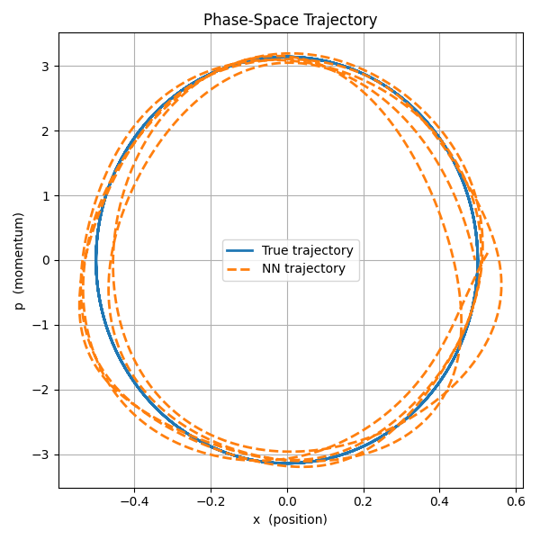

# Can we gain new physical insights by studying machine learning models? 

<!--My first level of understanding of machine learning (ML) models is that they are a big black box with lots of tuning nobs, or parameters, that allows you to approximate certain functions by correctly setting the parameters. 
This setting of parameters is done by training the model, the name given to the process of starting with random values of the parameters and then moving the nobs in the direction that reduces how far the black box is from the desired function. 
One of the main goals of this blog post to show why this point of view, while true, completely overlooks how interesting ML is. 
In fact, I'll try to argue that if you have any interest in science (which I take to mean a general knack for trying to understand how the world work) then you would find digging deeper than this surface level black box point of view an incredibly rewarding exercise. -->

<!--ML models have proved to be useful in many tasks now, but perhaps the most notable, and the most seen by the public are chat bots. 
The most natural question to ask when using these chat bots is how they are able to generate the responses they output. 
Certainly, it's not like they have a massive database of all possible prompts and responses that they go through. However it's also not clear if they "understand" the conversation. 
If this is your very first encounter to such a question, it is very hard to make progress in a meaningful way. 
Part of this is that it is very hard to gauge "understanding", speaking from experience of years trying to teach human students about physics. 
But also part of the difficulty is that models like ChatGPT, Lama, and Gemma, are very complex with very complicated structures like "attention" that makes it hard to "see" what is going on. 
The easy way out is just to shrug the question off and say it's just a big enough black box with enough parameters to do the job, which was my attitude, up until recently. -->

What does it mean for a machine learning (ML) model to have learned a "concept" related to the task it's doing? This is a hard question to answer because a "concept" is one of these things we have no issue using in our everyday language, but when you sit down and actually try to properly define, it is hard to pin down. This blog will discuss this issue, and why it might be important for discovering new science. 

Most of us now interact with ML models through chat bots. At least in the early days of starting using these bots, the first question people tend to ask is whether they actually understand the conversation. It is very hard to gauge "understanding", even in real humans, speaking from experience of years trying to teach students about physics.  People much smarter than me have tried to give an appropriate definition. I'll give one of my own later on. Historically, it seems that saying a network has learned a concept is a you "know it when you see it" kind of thing. An example is the best way to explain this. This example is from the world of natural language processing. Consider a network that takes as an input an $N$-gram (a sequence of $N$ words that make a sentence or are part of a sentence). The output of the network is to determine whether this $N$-gram is proper English. For example "the dogs are playing outside" is a valid $5$-gram, whereas "the chairs are playing outside" is not a valid $5$-gram (at least not in our world). One can construct the training data quite easily. Start with any corpus, take every $N$-grams and label them as the valid grams. From a valid $N$-gram, if we randomly substituted a single word, it's very likely that we end up with an $N$-gram that is invalid.

The neural network will have multiple layers to be able to perform the task of determining whether an $N$-gram is valid English or not. For our example, we only need to focus on the representation layer. <!--Let's say that words first enter the network using a $1$-of-$L$ coding, where $L$ is the number of words in your vocabulary. This way of representing words is maybe not very useful as it carries no information about relationships between different words. -->
The job of the representation layer is to take every word $x$ and map it to to a vector in a, let's say, $50$-dimensional space $w(x)$. The way words are represented using $w(x)$ is not something that we impose on the network. Instead, we let this representation be part of what the network learns during training. 
The hope is that the learned representation carry information about relationships between different work that would aid the network performing its ultimate goal. 

After training is done, the network learns to cluster words of similar meaning close to each other. For example one would find $||w(\text{dog}) - w(\text{dogs})|| \ll ||w(\text{dogs}) - w(\text{cats})|| \ll ||w(\text{dog}) - w(\text{chair})||$. 
What is more fascinating, and what really started my interest about subject, is that the network seems to learn semantic relationships between words as well! 
For example, if we look at the vectors $c_1 = w(\text{king}) - w(\text{queen})$ and $c_2 =  w(\text{uncle}) - w(\text{aunt})$, we find that $c_1 \approx c_2$. 
One might form the hypothesis that $c_1 \approx c_2 \approx c_{\text{gender}}$, i.e. the vector that carry the concept of gender. 

I want to take a second here to emphasis what qualifies as a hypothesis, from the point of view of doing science. For a statement to qualify as hypothesis it need to be falsifiable. If we cannot come up with a test, were one of the outcomes would disprove the hypothesis, then it is no good. This is the foundation for doing science. Fortunately, we can come up with a test for our $c_{\text{gender}}$ hypothesis. We can predict the position for the embedding of the word, let's say, "father", using $w(\text{father}) = w(\text{mother}) + c_{\text{gender}}$. 
Of course what we really need to do is look for the word with the closest vector to $w(\text{mother}) + c_{\text{gender}}$, but I'll gloss over such detail. 
Indeed, with a good degree of accuracy the hypothesis hold. As you can probably already imagine, we can construct similar vectors for other concepts as well. 

I think most people would agree that in the above example, the network has learned concepts in a way that we can understand. There are other instances where ML models have shown that it can behave, based on its training, in a way that is much less understood by humans. Take the example of AlphaGo's game against Lee Sedol who's regarded to be the best Go player (though don't quote me on that, I'm sure some people might disagree). On move 37 of one of the games AlphaGo made a very unusual move that confounded all commentators, spectators, and Lee Sedol himself. AlphaGo would win that game, and move 37 would become very popular (as featured in the documentary by DeepMind) as a move where AlphaGo demonstrated knowledge, and understanding of the game that is beyond human knowledge and understanding. This is certainly such an interesting prospect. Can we train models such that they would learn something we never learned before? 
This certainly seems plausible, but immediately begs the question: how do we extract this knowledge? Unbeknownst to me, there is a whole branch of ML/AI research dedicated to this problem of interpretability. 

Back to the question in the title. What does this all mean for physics. 
ML models have been used in various physics applications. 
Since I'm not familiar with the field, I want to start with something simple.  
As Sidney Coleman would say, "The career of a young theoretical physicist consists of treating the harmonic oscillator in ever-increasing levels of abstraction." I don't believe I'm considered young anymore, but I also don't think Coleman had studying the harmonic oscillator using ML in mind either. 
Anyway, if you are not familiar, a harmonic oscillator is a body with mass $m$ that is attached to a spring with a spring constant $k$.
Classically, the one-dimensional harmonic oscillator state is fully described by its position $x$ and momentum $p$. We can try to train an ML model to learn the dynamics of this system. One way to train this model is to give the model $X = (x_0,\  p_0,\ t)$ and ask it to output $Y = (x(t), \ p(t))$. With the help of ChatGPT, I built a neural network with $4$ hidden layers ($16$ units in the first and last layers, and $32$ units in the middle two). Training this network on $5\times 10^4$ samples of $(X,Y)$, yields pretty dismal results to be honest. I was curious, I had to try. Here is a plot for the predicted trajectory of the model: 

One can say the model learned something about the system. The trajectory kind of resemble a circle (as it should). But even in this very simple of examples it is very hard to say what exactly has the model learned. 

I think to be able to say the model has learned something one should be able to formulate this something as a hypothesis. Remember, the most important pillar of an hypothesis is that it needs to be falsifiable. In the harmonic oscillator example, one might form the hypothesis that the model learned about conservation of energy. Testing this hypothesis is easy. For a set of outputs of the model $(x(t), \ p(t))$ compute the energy $E(t) = p^2(t)/2m +  kx^2(t)/2$, and see if it is a function of time. Our neural network above clearly didn't learn about conservation of energy, and thus the hypothesis is false in this case. 

In the literature, there are multiple attempts to try to solve the harmonic oscillator by designing networks that automatically respect energy conservation. 
This is not really the point of this exercise. We are not trying to teach the network some concept that we humans already know. What I'm interested in here is trying to train the network somewhat agnostically, and see if gradient descent imposed some structure on the network that we can study and learn something new from. Of course in this regard the harmonic oscillator is a bad example since we understand every aspect of it. 

Note that defining a concept as a hypothesis about the behavior of the network is rather stringent. For example, move 37, while impressive, cannot be formulated as a hypothesis. In my view, taking such definition of a concept learned by a network is the first step to bring interpretability work more within the realms of science. How else can we deal with fuzzy concepts? 

The interesting prospect at the intersection of interoperability and physics is the following: can we reach a point where we train a model that is very good in predicting physical phenomena that our best bet to understand these phenomena is to understand the model we created. I certainly don't know the answer to this question, but the thought of such possibility makes me excited about this area of research. 
